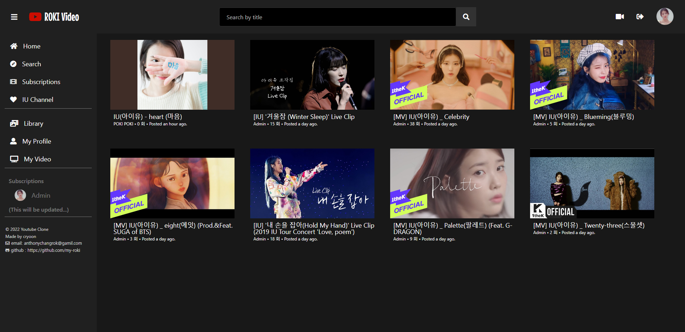
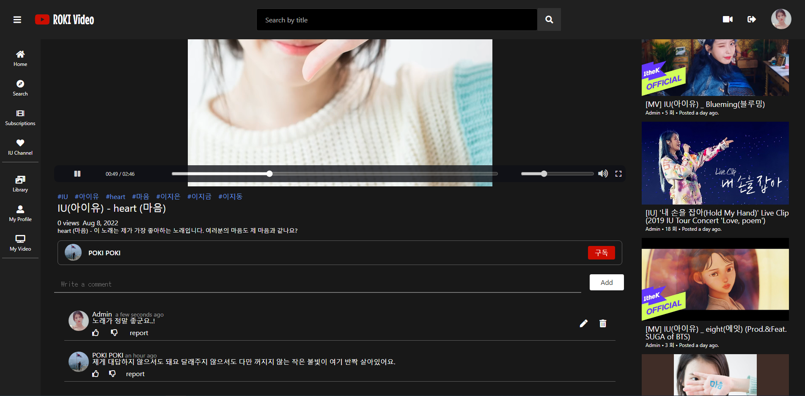

# Youtube Clone

<a href="[https://youtube-myroki.herokuapp.com/](https://youtube-myroki.herokuapp.com/)" target="_blank">Heroku Page</a>

### What I Learned.

- [x] User Authentication
- [x] Log In / Log out
- [x] Github Login
- [x] User Profile

- [x] Video Upload
- [x] Video Recording
- [x] Search Video
- [x] AJAX Comments
- [x] View Count

- [x] Heroku
- [x] S3 Upload
- [x] Mongo Atlas

- [x] MVC
- [x] Routing
- [x] Templates
- [x] Models
- [x] Relationships

### What I Updated.

- [x] Comments CRUD
- [x] Google and Kakao Login
- [x] Video control panel customize
- [x] SCSS styles update

### What I Should Do.

- [] Video screen view
- [] Subscribe & Like page
- [] Subscribes in sidebar
- [] Play Random video page
- [] Strength users and videos CRUD
- [] Update like, dislike and report functions

Copyright

<a href="https://nomadcoders.co/wetube" target="_blank">
      
    NomadCoder - [풀스택] 유튜브 클론코딩
</a>
